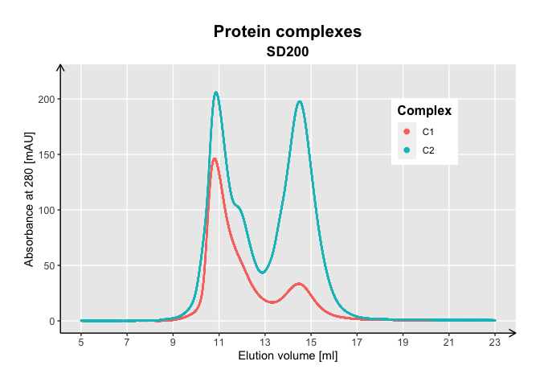

FPLC chromatogram
================

``` r
knitr::opts_chunk$set(fig.path='Figs/')
```

## Setting working directory.

``` r
setwd("~/Desktop/GitHub/Homework_3")
```

## Loading the packages.

``` r
#Load data.table and ggplot2 packages.

library(data.table)
library(ggplot2)
```

## Importing the workbook.

``` r
#Load the workbook using fread().

workbook <- fread("AKTA.csv")
```

## Make the plot.

``` r
#Making the plot.

ggplot(workbook, aes(x = SPRml, y = SPRuv, color = Complex)) +
  geom_point(size = 0.1) +
 
#Adjusting the scales.
  
  scale_x_continuous(breaks=c(5,7,9,11,13,15,17,19,21,23), limits = c(5, 23)) +
  ylim(0, 220) +
 
#Adding labels to ahes and the title. 
  
  labs(x = "Elution volume [ml]", y = "Absorbance at 280 [mAU]", title = "Protein complexes", subtitle = "SD200") +
 
#Changing the size of the dots in the legend. 
  
  guides(colour = guide_legend(override.aes = list(size=2))) +

#Making the plot pretty.
  
  theme( 
    legend.position = c(0.8, 0.75),
    legend.title = element_text(size = 12),

    panel.grid = element_blank(),
    panel.grid.major = element_line(colour = "white"), 
    panel.background = element_rect(fill = "grey92", colour = NA),
    
    axis.title = element_text(face = "plain", size = 11),
    axis.line = element_line(color = "black", arrow = arrow(length = unit(0.1, "inches"))),
    
    axis.text.x = element_text(size = 9.5), 
    axis.text.y = element_text(size = 9.5),
    
    
    title = element_text(face = "bold", size = 13),
    
    plot.subtitle = element_text (hjust = 0.5),
    plot.title = element_text(hjust = 0.5),

    plot.margin = margin(0.8, 0.8, 0.8, 0.8, "cm"))
```

    ## Warning: Removed 33967 rows containing missing values (geom_point).

<!-- -->
