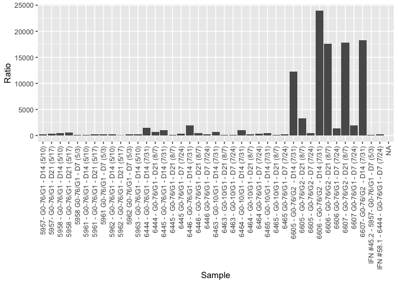

Thea’s graph
================
Althea Bock-Hughes
7/27/2020

## my original plot

[My Graph](example%20graph.png)

``` r
ELISA <- read_excel("Example ELISA data.xlsx", sheet = "Ratio")
```

    ## New names:
    ## * `Ratio (ug Alb/mg Cre)` -> `Ratio (ug Alb/mg Cre)...4`
    ## * `` -> ...6
    ## * `Ratio (ug Alb/mg Cre)` -> `Ratio (ug Alb/mg Cre)...7`

``` r
names(ELISA)[4] <- "Ratio"

summary(ELISA)
```

    ##     Sample           Alb (ng/ml)        CRE (mg/dL)     
    ##  Length:41          Min.   :    9188   Min.   :  7.259  
    ##  Class :character   1st Qu.:   76612   1st Qu.: 27.204  
    ##  Mode  :character   Median :  133232   Median : 41.077  
    ##                     Mean   : 1307641   Mean   : 44.985  
    ##                     3rd Qu.:  364370   3rd Qu.: 62.303  
    ##                     Max.   :11416696   Max.   :103.531  
    ##                     NA's   :1          NA's   :1        
    ##      Ratio          Samples outside of Std curves     ...6          
    ##  Min.   :   53.15   Length:41                     Length:41         
    ##  1st Qu.:  207.11   Class :character              Class :character  
    ##  Median :  321.01   Mode  :character              Mode  :character  
    ##  Mean   : 2745.01                                                   
    ##  3rd Qu.: 1139.22                                                   
    ##  Max.   :23967.64                                                   
    ##  NA's   :1                                                          
    ##  Ratio (ug Alb/mg Cre)...7
    ##  Min.   :   53.15         
    ##  1st Qu.:  209.19         
    ##  Median :  333.26         
    ##  Mean   : 2813.62         
    ##  3rd Qu.: 1211.27         
    ##  Max.   :23967.64         
    ##  NA's   :2

## My Plot Recreation

    ## Warning: Removed 1 rows containing missing values (position_stack).

<!-- -->
