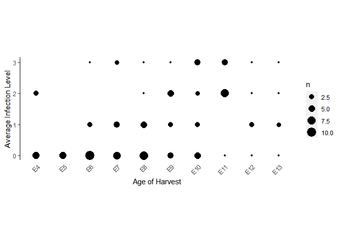

HW03 - Chicken Cochlea Infection Graph
================
Nabilah Sammudin
7/20/2020

For HW03 assignment, I decided to recreate a figure from my lab’s recent
publication. I contributed in the execution of the experiments and some
of the data analysis but not in the generation of figures. I initially
wanted to do both figure A and B from this section but I am having
troubles plotting the graph so I might just end up with only Figure A
for this assignment.

I was having troubles plotting repetitive values with ggplot. The graph
I initially got with geom\_point() looked wrong and that is when I found
out that geom\_point removes redundancy. I then wondered if character =
factor in an Excel file and if I can solve this problem by changing the
class\_types of my two variables. That didn’t work out. I also tried
geom\_jitters() but the values are all over the place. Technically, the
infection variable could also be considered as categorical as it only
has four values (0,1,2 and 3). However, plotting two categorical
variables would not give me a scatter plot. I settled with using
geom\_count although it is not exactly what I am looking to recreate.

There are four sheets in my Excel file. Sheets 1 and 2 are the original
data file I got from my lab. For ease of graphing, I had to
rearrange/reorder the original data, thus Sheets 3 and 4 are the result
of that rearrangement. Sheet 3 which you will see in my codes below is
for Graph 1. I spent a really long time on Graph 1 so I wasn’t able to
get to Sheet 4 for Graph 2.

Here is the image that contains both Figure A and B for reference.

\[Image
Link\](<https://anatomypubs.onlinelibrary.wiley.com/cms/asset/f6fba584-891e-4dc5-b38c-90bff40ebccb/dvdy176-fig-0005-m.jpg>

``` r
library(readxl)

library("ggplot2")
excel_sheets("infection.xlsx")
```

    ## [1] "For 3D graphs"                  "Infection scores for 3D graphs"
    ## [3] "Rearranged scores (Graph 1)"    " Rearranged scores (Graph 2)"

``` r
infection_level <- read_excel("infection.xlsx", sheet = "Rearranged scores (Graph 1)")

age_reorder <- factor(infection_level$age, level = c("E4", "E5", "E6", "E7", "E8", "E9", "E10", "E11", "E12", "E13"))
ggplot(infection_level, aes(age_reorder, infection)) +
  geom_count() +
  xlab("Age of Harvest") +
  ylab("Average Infection Level") +
  theme(panel.grid = element_blank(), panel.background = element_blank(), axis.line.y = element_line(), axis.text.x = element_text(angle = 45, hjust = 1), axis.ticks.x = element_blank()) +
  theme(aspect.ratio = 0.75/2)
```

<!-- -->

There are two things that are still lacking from this graph.

1)  I have yet to discover how I can visualize repetitive values using
    ggplot such as it appears like the figure I was trying to recreate.

2)  I have yet to learn how to compute statistical analysis in R so I
    wasn’t able to draw the error bars on my graph.

Overall thoughts: I think I could have easily chosen an easier example
but since this was a work that I personally worked on, I was determined
and interested to see how I can recreate Figure A. I will submit this
first to meet the homework deadline but I shall continue working on this
to figure it out\!
