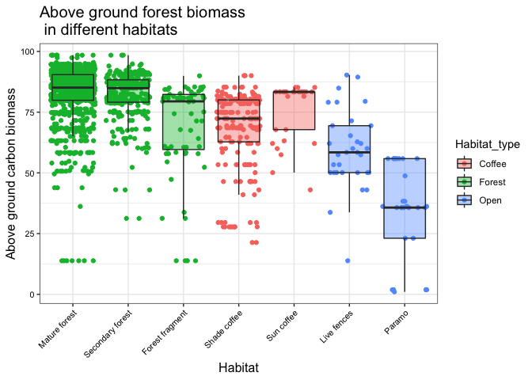

HW03
================
Laura Cespedes Arias

## Package loading

``` r
library("ggplot2")
library("readr")
library("MASS")
```

I decided to do a simple figure with some data I am analyzing right now.
The data is not public yet, so I uploaded a subset of our original data
table to make the graph. Specifically, this is data of above ground
carbon biomass [Baccini et
al 2017](https://science.sciencemag.org/content/early/2017/09/27/science.aam5962?versioned=true)
corresponding to stations where we counted migratory birds in Colombia.
For each station, we also assigned a habitat category. I wanted to
explore if the habitat category described fairly well the variation in
above ground biomass, which is a variable that is supposed to describe
the amount of “tree” biomass. Therefore, is expected that forested
habitats would have higher values than more open habitats.

## Data import

First, I imported the data table that I previously uploaded to
GitHub:

``` r
biomass_URL <- "https://raw.githubusercontent.com/lcespedesarias/HW03/master/CarbonBiomass_byHabitat.csv"
biomass <- read.csv(url(biomass_URL),h=T,sep=";")
head(biomass)
```

    ##   hansen_treeD hansen_treeD_1km                        Habitat
    ## 1           95         83.68416                   Shade_coffee
    ## 2           95         52.32880 Forest_fragment/Riparian_strip
    ## 3            7         69.27404                   Shade_coffee
    ## 4           91         83.29684                   Shade_coffee
    ## 5           86         83.29684                   Shade_coffee
    ## 6           96         86.64510                  Mature_forest

## Adjustments in the data table

Before making the figure I needed to reorder one variable (Habitat) and
create a new category called “Habitat type” (which is more general/broad
than “Habitat”):

``` r
biomass$Habitat <- factor(biomass$Habitat, 
                          levels = c("Mature_forest","Secondary_Growth",
                                     "Forest_fragment/Riparian_strip",
                                     "Shade_coffee","Sun_coffee",
                                     "Live_Fence/Pasture","Paramo"))

#This will be the new habitat variable
biomass$Habitat_type[biomass$Habitat %in% c("Mature_forest","Secondary_Growth",
                                     "Forest_fragment/Riparian_strip")] <- "Forest"

biomass$Habitat_type[biomass$Habitat %in% c("Shade_coffee","Sun_coffee")] <- "Coffee"

biomass$Habitat_type[biomass$Habitat %in% c("Live_Fence/Pasture","Paramo")] <- "Open"
```

## Figure

Now the figure. So, what I wanted was a simple figure to show how values
of above ground carbon biomass vary by habitat. I also wanted to
visually group the specific habitat categories according to the “broad”
habitat categories. Therefore, I decided to do a boxplot and color the
boxes according to the broad habitat category. This is what I
did:

``` r
ggplot(biomass,mapping = aes(x = Habitat, y = hansen_treeD_1km, fill=Habitat_type)) +
  #To change the default grey background
  theme_bw()+
  #To add the points and boxes (boxes with no outliers)
  geom_jitter(aes(color=Habitat_type)) +
  geom_boxplot(alpha=0.4,outlier.colour = NA)+
  #To add axes labels and adjust their size
  ylab("Above ground carbon biomass") +
  xlab("Habitat") +
  theme(axis.text.x = element_text(color="black", size=8, angle=45,hjust=1))+
  theme(axis.text.y = element_text(color="black", size=8))+
  theme(axis.title = element_text(color="black", size=12))+
  scale_x_discrete(labels=c("Mature forest","Secondary forest","Forest fragment",
                            "Shade coffee","Sun coffee","Live fences","Paramo"))+
  #To add title and change the default size
  ggtitle(label="Above ground forest biomass \n in different habitats")+
  theme(plot.title = element_text(size = 15))
```

<!-- -->

It looks like open habitats (paramo and live fences) do tend to have
lower values of above ground carbon biomass than forested habitats
(mature forest, secondary growth, forest fragments), as predicted :)
