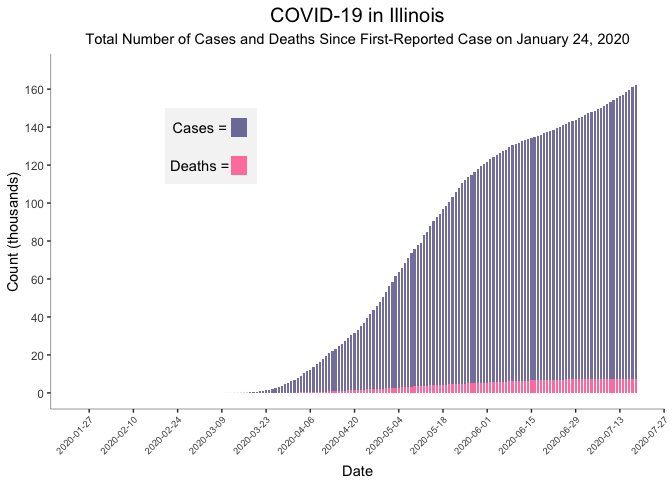
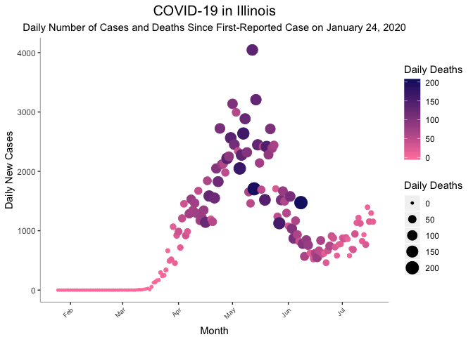

HW03 Olivia Pura
================

To start, I’m loading in the ggplot2, readr, and dplyr packages.

``` r
library("ggplot2")
library("readr")
library("dplyr")
```

I will be working with the NYT COVID-19 dataset, “us-states.csv”. I
forked this dataset from the NYT repository and uploaded them into my
own.

## Graph 1

My first graph will evaluate the total cases and deaths over time in
Illinois.

``` r
# filtering the dataset for Illinois data
il_data <- filter(state_data, state == "Illinois")

# formatting the date column using the as.Date() function for graph formatting
il_data$date <- as.Date(il_data$date)

# dividing the count of deaths and cases by 1,000 for cleaner axis
il_data$cases <- il_data$cases/1000
il_data$deaths <- il_data$deaths/1000

# creating the basic column chart to display cases over time
ggplot(il_data) +
  geom_col(aes(x = date, y = cases), fill = "midnightblue", alpha = 0.6, width = 0.7) +
  geom_col(aes(x = date, y = deaths), fill = "palevioletred1", alpha = 1, width = 0.7) + 
 
# formating axis labels to make graph legible
  scale_x_date(name = "Date", date_breaks = "2 weeks")  +
  scale_y_continuous(name = "Count (thousands)", limits = c(0, 170), 
                     breaks = seq(0, 170, 20),
                     minor_breaks = seq(0, 170, 10)) +
  
# adding a title and subtitle
  labs(title = "COVID-19 in Illinois", subtitle = "Total Number of Cases and Deaths Since First-Reported Case on January 24, 2020") +
  
# creating a legend
   annotate("rect", xmin = as.Date("2020-02-20"),
                   xmax = as.Date("2020-03-20"),
                   ymin = 110, ymax = 150,
                   fill = "grey92", alpha = 0.5) +
  annotate("text", x = as.Date("2020-03-02"), y = 140, label = "Cases =") +
  annotate("rect", xmin = as.Date("2020-03-12"),
                   xmax = as.Date("2020-03-17"),
                   ymin = 135, ymax = 145,
                   fill = "midnightblue", alpha = 0.6) +
  annotate("text", x = as.Date("2020-03-02"), y = 120, label = "Deaths =") +
  annotate("rect", xmin = as.Date("2020-03-12"),
                   xmax = as.Date("2020-03-17"),
                   ymin = 115, ymax = 125,
                   fill = "palevioletred1") +
  
# making the plot nicer
   theme(plot.subtitle = element_text (hjust = 0.5),
         plot.title = element_text(size = 15, hjust = 0.5),
         axis.line = element_line(color = "grey60", size = 0.3),
         axis.text.x = element_text(angle = 45, hjust=1, size = 7),
         axis.title.x= element_text(vjust = -1),
         panel.background = element_blank()) 
```

<!-- -->

## Graph 2

My second graph will evaluate the number of new cases each day, also in
Illinois

``` r
#created a new dataset with new variables for daily cases and daily deaths
il_daily_data <- filter(state_data, state == "Illinois")
il_daily_data$new_cases <- il_daily_data$cases - lag(il_daily_data$cases, 1)
il_daily_data$new_deaths <- il_daily_data$deaths - lag(il_daily_data$deaths, 1)

# formatting the date column using the as.Date() function for graph formatting
il_daily_data$date <- as.Date(il_daily_data$date)

#creating base scatterplot
ggplot(il_daily_data, mapping = aes(date, new_cases, 
                                    size = new_deaths, 
                                    fill = new_deaths, 
                                    color = new_deaths )) +
  geom_point() +
  scale_color_gradient(low = "palevioletred1", high = "midnightblue") +

# adding x-axis and y-axis labels
  scale_x_date(name = "Month")  +
  scale_y_continuous(name = "Daily New Cases") +
  
# adding a plot title and subtitle
  labs(title = "COVID-19 in Illinois", 
       subtitle = "Daily Number of Cases and Deaths Since First-Reported Case on January 24, 2020",
       size = "Daily Deaths",
       color = "Daily Deaths") +
  
# modify the plot legend for readability 
  guides(fill = FALSE) +

# making the plot nicer
   theme(plot.subtitle = element_text (hjust = 0.5),
         plot.title = element_text(size = 15, hjust = 0.5),
         axis.line = element_line(color = "grey60", size = 0.3),
         axis.text.x = element_text(angle = 45, hjust=1, size = 7),
         axis.title.x= element_text(vjust = -1),
         panel.background = element_blank()) 
```

    ## Warning: Removed 1 rows containing missing values (geom_point).

<!-- -->
