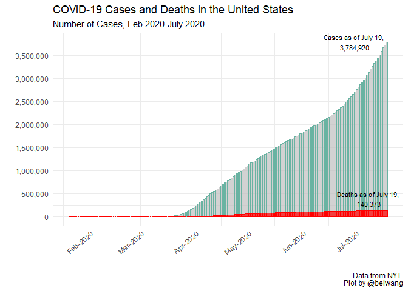
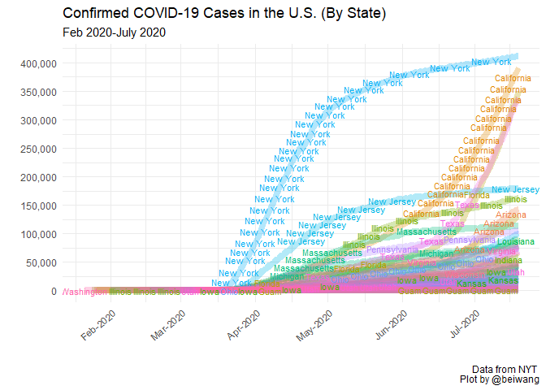

HW03 covid
================
Bei Wang
July 19, 2020

Covid-19 in the US
------------------

``` r
#packages used 

library("ggplot2")
library("dplyr")
```

    ## 
    ## Attaching package: 'dplyr'

    ## The following objects are masked from 'package:stats':
    ## 
    ##     filter, lag

    ## The following objects are masked from 'package:base':
    ## 
    ##     intersect, setdiff, setequal, union

``` r
library("magrittr")
```

Covid-19 in the US by states
----------------------------

``` r
#import datasets downloaded from NYT
national_data<- read.csv("https://raw.githubusercontent.com/nytimes/covid-19-data/master/us.csv", header=TRUE)
#transform "date" to date format
national_data$date<- as.Date(national_data$date)

#cases plot
national_caseplot<- national_data %>% 
  ggplot()+
  geom_col(aes(x=date, y=cases), color="#69b3a2", fill="grey", alpha=0.7)+
  geom_col(aes(x=date, y=deaths), color="red", fill="red", alpha=0.7)+
  theme_minimal()+
  #set axis
  scale_x_date(date_labels="%b-%Y")+
  scale_y_continuous(labels=scales::comma, breaks=seq(0, 4000000, by=500000))+
  theme(axis.text.x=element_text(angle=40, hjust=1))+
  #labels 
  labs(x="", y="", title="COVID-19 Cases and Deaths in the United States", caption="Data from NYT \n Plot by @beiwang", subtitle="Number of Cases, Feb 2020-July 2020")+
  #add labels of cases and deaths of July 19
  annotate("text", x=as.Date("2020-07-01"), y=3784920, label="Cases as of July 19, \n3,784,920", size=3)+
  annotate("text", x=as.Date("2020-07-09"), y=390373, label="Deaths as of July 19, \n140,373", size=3)
  
national_caseplot
```



``` r
#import datasets downloaded from NYT
state_data<- read.csv("https://raw.githubusercontent.com/nytimes/covid-19-data/master/us-states.csv", header=TRUE)
#transform "date" to date format
state_data$date<- as.Date(state_data$date)
state_data$state<- as.factor(state_data$state)

#plot by states
state_data %>% 
  ggplot(aes(x=date, y=cases, color=state, label=state))+
  geom_line(size=3, alpha=0.3)+
  theme_minimal()+
  theme(legend.position="none")+
  #set axis
  scale_x_date(date_labels="%b-%Y")+
  scale_y_continuous(labels=scales::comma, breaks=seq(0, 400000, by=50000))+
  theme(axis.text.x=element_text(angle=40, hjust=1))+
  #labels
  labs(x="", y="", title="Confirmed COVID-19 Cases in the U.S. (By State)", caption="Data from NYT \n Plot by @beiwang", subtitle="Feb 2020-July 2020")+
  #add text to lines
  geom_text(check_overlap = TRUE, size=3)
```


