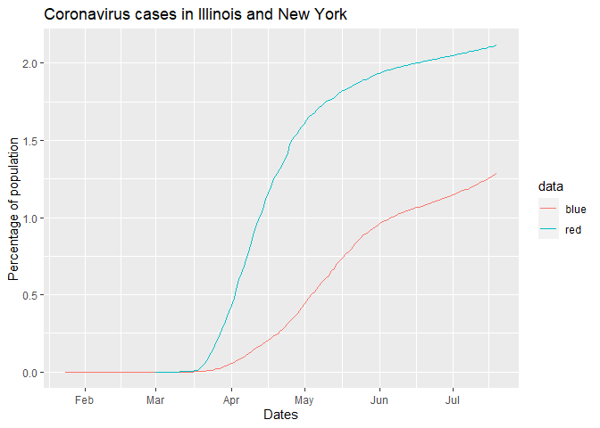

HW03
================
Ben Wang
7/20/20

### I decided to use the NYTimes coronavirus database to plot positive coronavirus cases in Illinois and New York, because these are the two places my brother and I are living. Below is the code for pulling the data from the New York Times database

``` r
states <- read.csv(url("https://raw.githubusercontent.com/nytimes/covid-19-data/master/us-states.csv"))

illinois <- states%>%
  filter(state == "Illinois")
nystate <- states%>%
  filter(state == "New York")
```

``` r
###Created separate plot for Illinois
illinois$date <- as.Date(illinois$date)
illinois_plot <- ggplot(illinois, aes(date, cases/12671821 * 100)) + 
  ###Population of IL estimated at 12,671,821 as of July 1st, 2020, by the US census bureau
  geom_point() +
  labs(title = "Illinois Coronavirus Cases", x = "Dates", y = "Percentage of population")

###Created separate plot for New York
nystate$date <- as.Date(nystate$date)
ny_plot <- ggplot(nystate, aes(date, cases/19453561 * 100)) + 
  ###Population of NY estimated at 19,453,561 as of July 1st, 2020, by the US census bureau
  geom_point() +
  labs(title = "New York Coronavirus Cases", x = "Dates", y = "Percentage of population")

###Combining the two plots together
ggplot() +
  geom_line(data = illinois, aes(x = date, y = cases/12671821 * 100, color = 'blue')) +
  geom_line(data = nystate, aes(x = date, y = cases/19453561 * 100, color = 'red')) +
  labs(x = "Dates", y = "Percentage of population", color = "data", title = "Coronavirus cases in Illinois and New York") 
```

<!-- -->

``` r
  theme(plot.title = element_text(hjust = 10)) +
  ###I tried to center the plot title, but for some reason I was unable to with this code :(
  ###Also tried different combinations of code to get the figure legend properly labeled but I kept getting error messages so I eventually gave up. Will come back to this when I have time
  theme(panel.grid = element_blank())
```

    ## List of 2
    ##  $ plot.title:List of 11
    ##   ..$ family       : NULL
    ##   ..$ face         : NULL
    ##   ..$ colour       : NULL
    ##   ..$ size         : NULL
    ##   ..$ hjust        : num 10
    ##   ..$ vjust        : NULL
    ##   ..$ angle        : NULL
    ##   ..$ lineheight   : NULL
    ##   ..$ margin       : NULL
    ##   ..$ debug        : NULL
    ##   ..$ inherit.blank: logi FALSE
    ##   ..- attr(*, "class")= chr [1:2] "element_text" "element"
    ##  $ panel.grid: list()
    ##   ..- attr(*, "class")= chr [1:2] "element_blank" "element"
    ##  - attr(*, "class")= chr [1:2] "theme" "gg"
    ##  - attr(*, "complete")= logi FALSE
    ##  - attr(*, "validate")= logi TRUE
