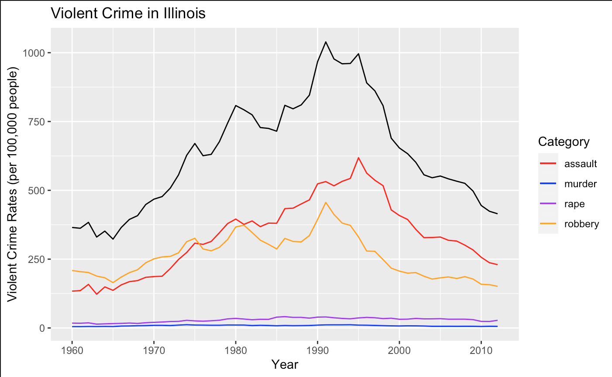
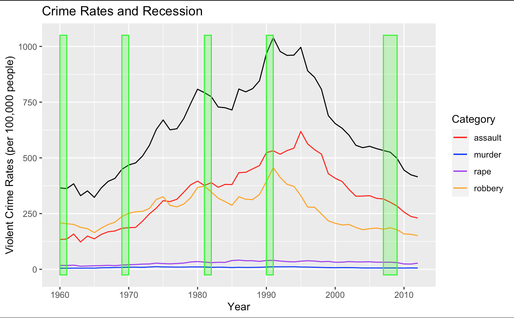
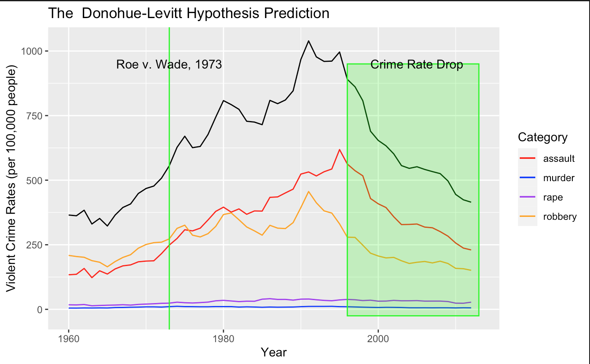
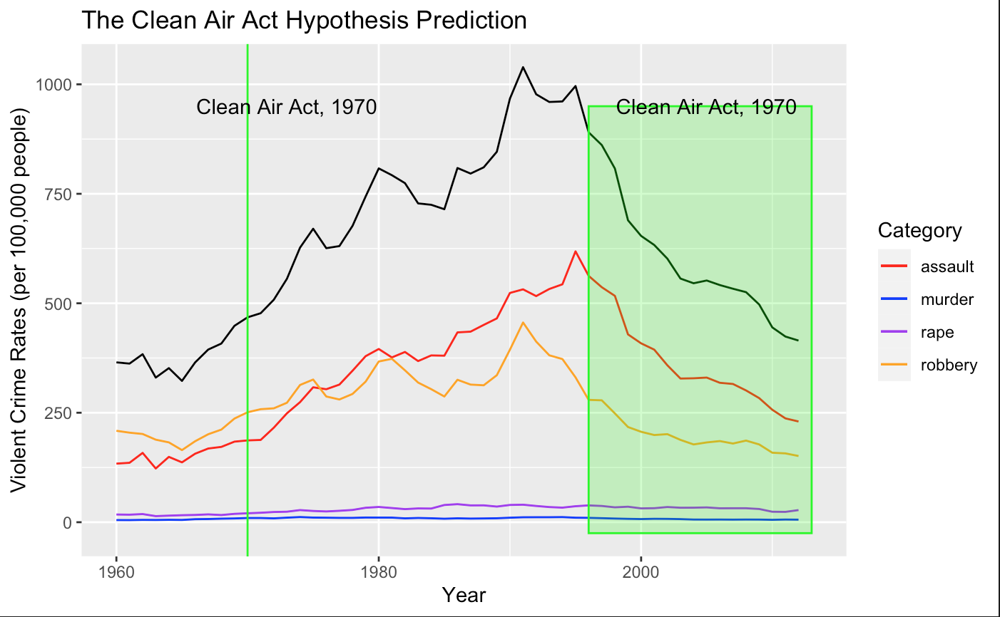

HW03
================
Honorine Destain
7/18/2020

Data Source
-----------

I used data regarding state crime rates, which can be found here: <https://corgis-edu.github.io/corgis/csv/state_crime/>. To narrow down the data, I focused only on crime rates within Illinois.

The file can be found in the assignment file as [state\_crime.csv](state_crime.csv).

Background
----------

In graphing violent crime rates in Illinois over time, I saw a peak in 1990 before a following sharp fall. I found a couple theories as to why this might be online, which I investigated through the following plots.

Economic Growth
---------------

One theory is that economic growth after the 1990s contributed to a decrease in crime--the idea being that more people were employed and better off than before, and therefore less likely to resort to committing crimes. This theory predicts that crime rates should increase in times of economic crisis, and while this is true in 1969-1970 and and 1990-1991, this relationship is not observed in other recessions--even in the Great Recession of 2007-2009 preceded by the bursting of the housing bubble.

The Donohue-Levitt Hypothesis
-----------------------------

In 2001, Steven Levitt (a University of Chicago economics professor!) and John Donohue (at Yale) suggested that legalization of abortion through *Roe v. Wade (1973)* was the cause of the drop in crime rate. Because children that are insufficiently supported are more likely to cause crime, they argued, access to abortion reflected this in the drop in crime rate (at a lag of ~20 years, the time it would take for these children to grow up).

Several criticisms have arisen following this hypothesis; Foote and Goetz argue that other crime-associated factors were not sufficiently controlled for in the analysis, and Shah and Ahman argued that laws against abortion do not actually reduce abortion occurrence.

I was hoping to plot abortion rates to explore Shah and Ahman's arguments; unfortunately, the abortion statistics report of Illinois do not extend before 1995. <https://dph.illinois.gov/data-statistics/vital-statistics/abortion-statistics/archived-reports>.

Clean Air Act
-------------

*Roe v. Wade (1973)* wasn't the only legislative change of the 70s to impact the next generation's population. Economist Jessica Reyes (at Amherst) points to the Clear Air Act of 1970, which prompted the removal of lead from gasoline, as a contributor to the drop in crime rate. Her hypothesis suggests that decreased lead exposure, which stunts intellectual growth, would cause the resulting generation to decrease acts of violent crime (once again, with a ~20 year lag).

