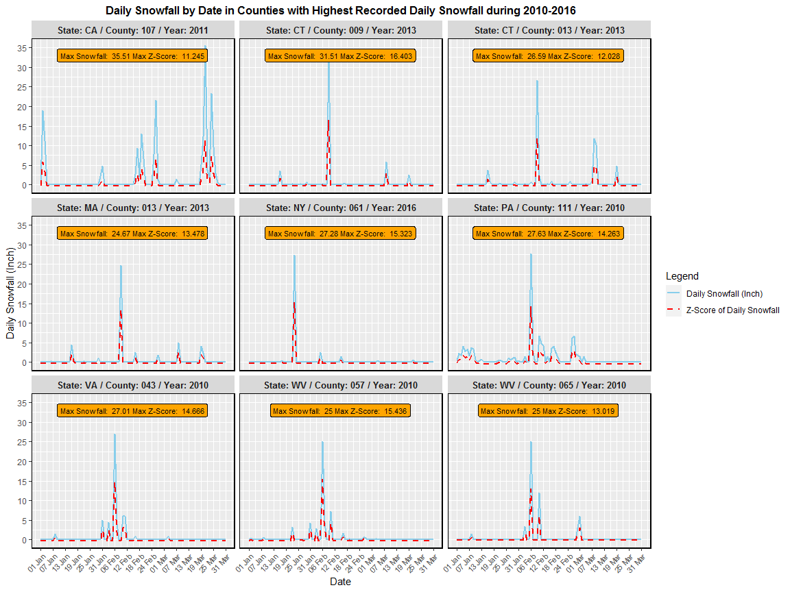

HW03
================
Mingyu Qi
7/20/2020

## Load libraries

``` r
library("ggplot2")
```

## Importing data set

Import a CSV data set of daily snowfall from January to March in the 9
US counties with **highest recorded daily snowfall** during 2010-2016
period.

``` r
snow <- read.csv("D:/BSDG_30901/Project/HW03/Snow.csv", head=TRUE)
attach(snow)
```

## Create a numeric variable based on factor variable “new date”

``` r
new_date <- factor(new_date, levels=unique(new_date[order(month,day)]), ordered=TRUE)
new_date_2 <- as.numeric(new_date)
```

## Create a panel of line graphs of daily snowfall and z-score of daily snowfall by date

``` r
#Plot daily snowfall on date
ggplot(snow, aes(new_date_2, daily_snow_county_inch)) +
geom_line(aes(group=1, color="Daily Snowfall (Inch)", linetype="Daily Snowfall (Inch)"), size=1) +
#Add another line: z-score of daily snowfall 
geom_line(aes(new_date_2, daily_snow_county_z, group=1, color="Z-Score of Daily Snowfall", linetype = "Z-Score of Daily Snowfall"), size=1) +
#Add annotation of max snowfall and max z-score within each group
geom_label(x=45.5, y=33, aes(label = paste("Max Snowfall: ", max_snow, "Max Z-Score: ", max_z)), fill="orange", size=3) +
#Create a panel based on variable group_label, which indicates state, county, and year
facet_wrap(~group_label) + 
#Format x-axis
scale_x_continuous(name="Date", breaks=seq(1, 91, by = 6), labels=c("01 Jan", "07 Jan", "13 Jan", "19 Jan", "25 Jan", "31 Jan", "06 Feb", "12 Feb", "18 Feb", "24 Feb", "01 Mar", "07 Mar", "13 Mar", "19 Mar",
"25 Mar", "31 Mar")) +
#Format y-axis
scale_y_continuous(name="Daily Snowfall (Inch)", breaks = seq(0, 36, by = 5)) +
#Create legend manually 
scale_color_manual(name = "Legend", values = c("Daily Snowfall (Inch)" = "skyblue", "Z-Score of Daily Snowfall" = "red")) + 
scale_linetype_manual(name = "Legend", values = c("Daily Snowfall (Inch)" = "solid", "Z-Score of Daily Snowfall" = "dashed")) + 
theme(axis.text.x = element_text(angle = 45, hjust=1, size=8)) + 
#Add a title 
labs(title="Daily Snowfall by Date in Counties with Highest Recorded Daily Snowfall during 2010-2016") + 
#Edit the theme of plot
theme(plot.title = element_text(hjust = 0.5, size=12, face="bold"),
      strip.text = element_text(size=10, face="bold"), 
      panel.border = element_rect(colour = "black", fill=NA, size=1))
```

<!-- -->
