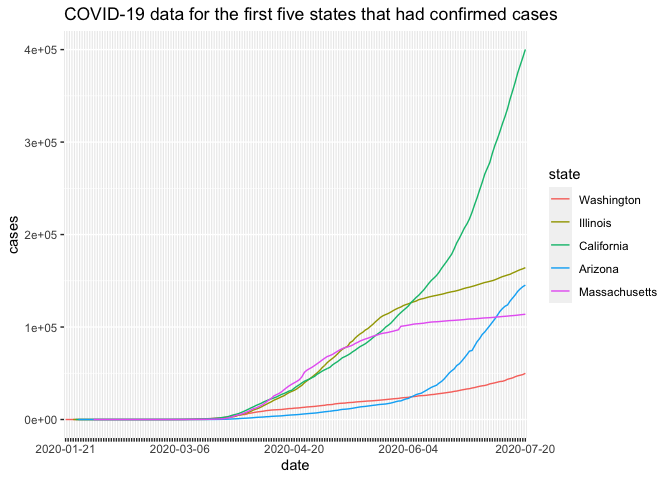

HW03\_Xiaoshan
================
Xiaoshan Ke

``` r
library("ggplot2")
library("forcats")
library("dplyr")
```

    ## 
    ## Attaching package: 'dplyr'

    ## The following objects are masked from 'package:stats':
    ## 
    ##     filter, lag

    ## The following objects are masked from 'package:base':
    ## 
    ##     intersect, setdiff, setequal, union

I am curious about how did the data change for the five states where
covid-19 cases were first confirmed, so I will select them from the
large dataset and am going to make a plot them.

## Importing data

For states that have confirmed cases earlier, they will appear more
frequent in the table than others. Therefore I will find them by
counting the frequency of each states. To do this, I used the
fct\_infreq() from the existed r library
“forcats”.

``` r
states <- read.csv(url("https://raw.githubusercontent.com/nytimes/covid-19-data/master/us-states.csv"))
states$state = fct_infreq(states$state)
head(summary(states$state),5)
```

    ##    Washington      Illinois    California       Arizona Massachusetts 
    ##           182           179           178           177           171

## Making the plot

Since the five states are Washington, Illinois, California, Arizona, and
Massachusetts, I will select them individually and combining them into a
large dataset, then make a plot. I think this might be a little bit
complicated and I am wondering if there’s a simpler way of doing this.

``` r
five <- states %>%
  filter(state == "California"|state == "Illinois"|state == "Washington"|state == "Arizona"|state == "Massachusetts")

ggplot(five, aes(date, cases, group = state)) +
  geom_line(aes(color = state)) +
  scale_x_discrete(guide = guide_axis(check.overlap = TRUE))+  
  ggtitle("COVID-19 data for the first five states that had confirmed cases")
```

<!-- -->
