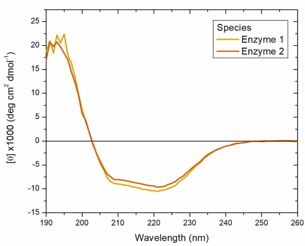
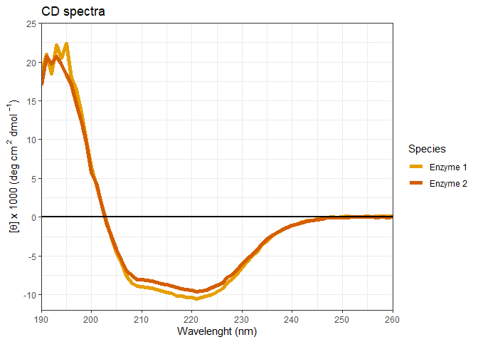
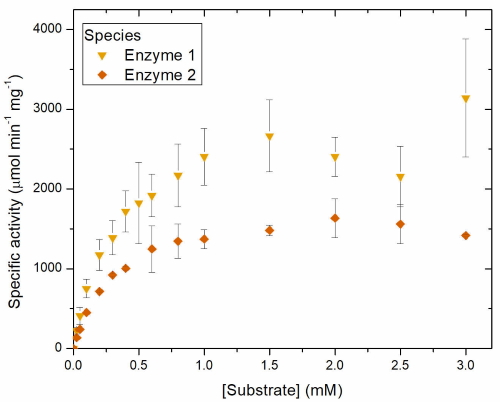
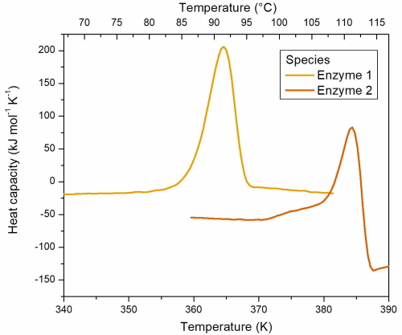
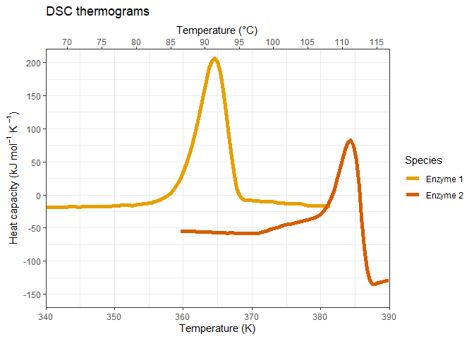
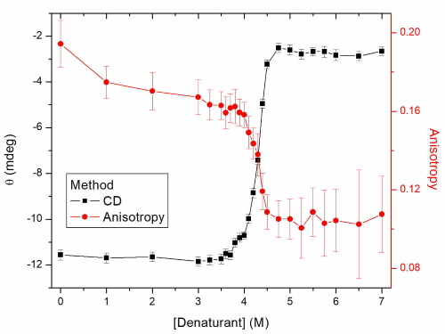

HW03\_Graphs
================
Ricardo Muñiz Trejo
20/7/2020

    ## Warning: package 'readr' was built under R version 4.0.2

    ## Warning: package 'readxl' was built under R version 4.0.2

    ## Warning: package 'ggplot2' was built under R version 4.0.2

## Introduction

For this assignment, I decided to recreate some of the graphs of my
master’s thesis. Originally, my graphs were created with Origin 7
(images included for comparison). Because this is unpublished data, I
censored the names, but basically the data presented here is from the
physical-chemical characterization a couple of thermophilic enzymes.

These aren’t exactly my original graphs since my thesis is in Spanish,
so I needed to convert them to English first. Also, my recreated graphs
aren’t meant to be perfect. I find that ggplot2 is much more versatile
than Origin in customizing graphs and I like that a lot :heart:.

To practice importing files with different R packages, I decided to
divide this homework in three sections:

  - utils
  - readr
  - readxl

## utils package

For this section, I’m going to recreate circular dichroism (*CD*) and
catalytic activities graphs, for that purpose, I created a couple of
*txt* files (available in data), one with data separated by slashes “/”,
and the other with tabulate-separated values.

#### Circular Dichroism

Let’s start with CD spectra.

This one is the original graph: 

And here’s the code for its recreation using ggplot2:

``` r
#I choose some colors and shapes for each species beforehand from a colorblind-friendly palette. To simplify the scripts, here are some vectors for it
colorg <- c("#E69F00","#D55E00")
shapeg <- c(25, 23)

dc_data <- read.table("data/dichroism.txt", 
                      header = TRUE, 
                      sep = "/", 
                      stringsAsFactors = FALSE)

#CD data, Mean Residue Ellipticity ([theta]), is usually divided by 1000 to facilitate visualization
dc_data$Ellip_mod <- dc_data$Ellipticity / 1000

ggplot(data = dc_data, mapping = aes(x = Wavelength, y = Ellip_mod, color = Species, shape = Species)) +
  geom_line(size = 2) +
  geom_hline(yintercept = 0, size = 1) + #to add the reference line in y = 0
  scale_color_manual(values = colorg) +
  labs(title = "CD spectra",
       x = "Wavelenght (nm)",
       y = expression(paste("[",theta,"] x 1000 (deg cm "^{2}, " dmol "^{-1}, ")"))) + #{} are used to write things in superscripts, `expression()` also serves to add greek letters
  coord_cartesian(xlim = c(190, 260), ylim = c(-12, 25), expand = FALSE) + #To zoom the data accordingly
  #To specify the spacing between ticks
  scale_x_continuous(breaks = seq(190, 260, 10)) +
  scale_y_continuous(breaks = seq(-15, 25, 5))
```

<!-- -->

What this data tells us is that both enzymes have the secondary
structure of an alpha/beta protein.

#### Catalytic Activity

As with any other enzymes, it is important the determine how good they
are at performing catalysis.

The original graph was this:



And this is the R recreation:

``` r
cat_data <- read.delim("data/catalysis.txt", 
                       header = TRUE, 
                       stringsAsFactors = FALSE)

ggplot(data = cat_data, mapping = aes(x = Substrate, y = Specific.activity, fill = Species, shape = Species)) +
    geom_errorbar(aes(ymin = Specific.activity-SD, ymax = Specific.activity+SD), width = 0.08, alpha = 0.4) + #A good chance to practice the Stat chapter of DataCamp
  geom_point(color = "white", size = 3) +
  scale_fill_manual(values = colorg) + #Not color, but fill, serves the same purpose though.
  scale_shape_manual(values = shapeg) +
  labs(title = "Enzymatic activity assays",
       x = "[Substrate] (mM)",
       y = expression(paste("Specific activity(\u03bcmol min "^{-1}, " mg "^{-1},")"))) + #\u03bc is the greek letter micro in Unicode
  coord_cartesian(xlim = c(0, 3.2), ylim = c(0, 4000), expand = FALSE) +
  scale_x_continuous(breaks = seq(0, 3, 0.5)) +
  scale_y_continuous(breaks = seq(0, 4000, 1000))
```

<!-- -->

I left out the Michaelis-Menten fit because doing it in R is way too
complex for me to program right now, but there are ways to include it
with `geom_smooth()`.

## readr package

For this section I simply included a *csv* file with differential
scanning calorimetry (*DSC*) data.

#### DSC

DSC thermograms can be used to determine the melting temperature of a
protein (seen at the top of each transition) and to extract some
calorimetric parameters of protein denaturation. You can see the
original graph here:



And this is the recreation of it in R:

``` r
names <- c("temp", "heat_cap", "Species")
dsc_data <- read_csv("data/calorimetry.csv", skip = 1, col_names = names) #It already has the column names in the first row, but I wanted to play a little bit
```

    ## Parsed with column specification:
    ## cols(
    ##   temp = col_double(),
    ##   heat_cap = col_double(),
    ##   Species = col_character()
    ## )

``` r
ggplot(data = dsc_data, mapping = aes(x = temp, y = heat_cap, color = Species)) +
  geom_line(size = 2) +
  scale_color_manual(values = colorg) + 
  labs(title = "DSC thermograms",
       x = "Temperature (K)",
       y = expression(paste("Heat capacity (kJ mol "^{-1}, " K "^{-1}, ")"))) +
  scale_x_continuous(sec.axis = sec_axis(~.-273.15, name = "Temperature (°C)", breaks = seq(70, 115, 5))) + #A good example of using secondary axis to improve the interpretation of a graph
  scale_y_continuous(breaks = seq(-150, 200, 50)) +
  coord_cartesian(xlim = c(340, 390), ylim = c(-170, 220), expand = FALSE)
```

<!-- -->

## readxl package

Finally, I wanted to use this package to select a single sheet from and
*xlsx* file that contained the data from all the previous graphs:

``` r
print(excel_sheets("data/thermophiles.xlsx"))
```

    ## [1] "DC"         "Catalysis"  "DSC"        "Denaturant"

#### Chemical denaturation

Ok, for this last one I took the liberty of changing the concept.
According to the Best Practices chapter in DataCamp, secondary axes
aren’t always a good thing, and I agree. That’s why I decided to use
facets to improve this graph on chemical denaturation of one of the
enzymes:



It was also a good idea to practice working with facets as it was part
of the Data visualization course:

``` r
#Only import the sheet called "Denaturant"
den_data <- read_excel("data/thermophiles.xlsx", sheet = "Denaturant")

ggplot(data = den_data, mapping = aes(x = Denaturant, y = Signal, fill = Method, color = Method)) +
  geom_point() +
  geom_line() +
  geom_errorbar(aes(ymin = Signal - SD, ymax = Signal + SD)) +
  scale_color_manual(values = c("red", "black")) +
  facet_wrap(vars(Method), scales = "free_y", ncol = 1) +
  labs(title = "Chemical denaturation curves",
       x = "[Denaturant] (M)",
       y = "Method signal",
       caption = "Anisotropy (no units), CD (mdeg)") +
  scale_x_continuous(breaks = seq(0, 7, 1))
```

<!-- -->

For a single protein, chemical denaturation can be seen using different
methods that relate to different aspects of protein structure and
function, in this case, anisotropy is a measurement of tertiary
structure, and CD is a measurement of secondary structure.
