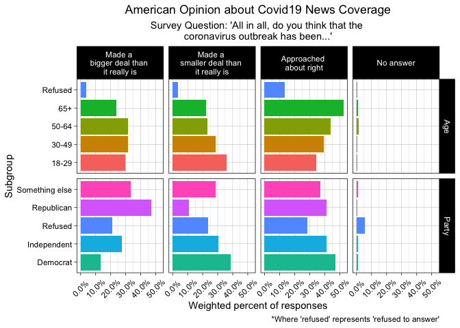

HW03\_Julia
================
Julia Shangguan
7/19/2020

``` r
knitr::opts_chunk$set(echo = TRUE, error = TRUE)
```

## HWO3: Looking at COVID-related data

There is a lot of cool data available from the Pew Research Center. Here
is where I downloaded my dataset from:
[PewResearchCenter](https://www.journalism.org/dataset/covid-19-late-april-2020/)

**Loading in necessary packages and installing packages:**

``` r
install.packages('survey') #install this package for analysis of data analysis
```

    ## Error in contrib.url(repos, "source"): trying to use CRAN without setting a mirror

``` r
library(survey)
```

    ## Loading required package: grid

    ## Loading required package: Matrix

    ## Loading required package: survival

    ## 
    ## Attaching package: 'survey'

    ## The following object is masked from 'package:graphics':
    ## 
    ##     dotchart

``` r
install.packages('tidyverse')
```

    ## Error in contrib.url(repos, "source"): trying to use CRAN without setting a mirror

``` r
library(tidyverse)
```

    ## ── Attaching packages ─────────────────────────────────────────────────────── tidyverse 1.3.0 ──

    ## ✓ ggplot2 3.3.2.9000     ✓ purrr   0.3.4     
    ## ✓ tibble  3.0.3          ✓ dplyr   1.0.0     
    ## ✓ tidyr   1.1.0          ✓ stringr 1.4.0     
    ## ✓ readr   1.3.1          ✓ forcats 0.5.0

    ## ── Conflicts ────────────────────────────────────────────────────────── tidyverse_conflicts() ──
    ## x tidyr::expand() masks Matrix::expand()
    ## x dplyr::filter() masks stats::filter()
    ## x dplyr::lag()    masks stats::lag()
    ## x tidyr::pack()   masks Matrix::pack()
    ## x tidyr::unpack() masks Matrix::unpack()

``` r
library("ggplot2")
library(foreign) #needed to import my dataset
library(scales) #needed to later convert my x-axis labels from decimal to percent
```

    ## 
    ## Attaching package: 'scales'

    ## The following object is masked from 'package:purrr':
    ## 
    ##     discard

    ## The following object is masked from 'package:readr':
    ## 
    ##     col_factor

**Importing my dataset as an R data.frame:**

``` r
Covid_data <- read.spss("Pathways April 2020 (ATP W66).sav", to.data.frame = TRUE) 
```

**The survey question I will be examining is**: “All in all, do you
think that the coronavirus outbreak has been…”

  - made a bigger deal than it really is

  - made a smaller deal than it really is

  - approached about right

  - no answer

A lot of my time was spent trying to understand how this dataset was
organized. I found this
[document](https://www.pewresearch.org/wp-content/uploads/2018/05/Codebook-and-instructions-for-working-with-ATP-data.pdf)
that explained what the demographic profile variables meant. The
variables corresponding to each survey question response were included
in this document titled [Pathways April 2020 ATP
W66](Pathways_April%202020_ATPW66_%20Topline.pdf) which comes with the
dataset download. I am interested in responses as stratified by age
(F\_AGECAT) and self-reported political party (F\_PARTY\_FINAL).

``` r
#names(Covid_data) #variables corresponding to each survey question
```

I will be plotting weighted survey estimates based on the variable
WEIGHT\_W66 because “data for all Pew Research Center reports are
analyzed using this weight.”

First, I am cleaning up my dataframe and limiting the dataset to only
the columns I need.

``` r
#limit to select columns, also renaming some columns
select_Covid_data <- Covid_data %>%
  select(weight = WEIGHT_W66, response = COVIDDEAL_W66, Age = F_AGECAT, Party = F_PARTY_FINAL) 

head(select_Covid_data) #checking that it worked
```

    ##      weight                             response   Age      Party
    ## 1 0.2948638               Approached about right   65+   Democrat
    ## 2 0.6897131 Made a BIGGER deal than it really is   65+ Republican
    ## 3 0.4420582               Approached about right   65+ Republican
    ## 4 0.4231892               Approached about right 30-49   Democrat
    ## 5 0.3680737               Approached about right 50-64   Democrat
    ## 6 0.5717572               Approached about right 50-64 Republican

I am rearranging the data so that I can easily calculate weighted
summary stats by each demographic group by reshaping data to a “long”
format. I’m not sure how to describe this, but [this
article](https://medium.com/pew-research-center-decoded/using-tidyverse-tools-with-pew-research-center-survey-data-in-r-bdfe61de0909)
touches upon it; this article was also just super helpful in general for
formatting Pew Research data sets.

``` r
select_Covid_data_long <- select_Covid_data %>%
  gather(key = subgroup_variable, value = subgroup, Age, Party)
```

    ## Warning: attributes are not identical across measure variables;
    ## they will be dropped

I can now get the weighted summaries for the subgroup variables by
adding a third grouping variable.

``` r
newstrust <-  select_Covid_data_long %>%
  group_by(subgroup_variable, subgroup, response) %>% 
  summarise(weighted_n = sum(weight))  %>%  #get the total sums of weights n for each category 
  group_by(subgroup) %>% #group to get subgroup category size
#add columns to get proportion values
  mutate(weighted_group_size = sum(weighted_n), 
         weighted_percent_responders = weighted_n / weighted_group_size
         )
```

    ## `summarise()` regrouping output by 'subgroup_variable', 'subgroup' (override with `.groups` argument)

OK, I have spent a lot of time trying to figure out how to manipulate
this data set instead of graphing it…which was not supposed to be the
focus of this assignment…I didn’t realize choosing this type of data set
was going to be this much work. Now I can finally graph it and try to
make it visually informative.

``` r
#renaming the "response" subvariables
newstrust$response <- 
 recode( newstrust$response, "Made a BIGGER deal than it really is" = "Made a \nbigger deal than \nit really is", "Made a SMALLER deal than it really is" = "Made a \nsmaller deal than \nit really is", "Approached about right" = "Approached \nabout right", "Refused" = "No answer")

ggplot(newstrust, aes(x = weighted_percent_responders, y = subgroup, fill = factor(subgroup))) +
   geom_bar(stat='identity') +
   scale_x_continuous(name = "Weighted percent of responses", labels = percent) +
   scale_y_discrete(name = "Subgroup") +
         facet_grid(cols = vars(response),
                    rows = vars(subgroup_variable),
                    scales = "free_y",
                    space = "free") +
         theme(axis.title.y = element_blank()) +
         theme_linedraw() +
  labs(title = "American Opinion about Covid19 News Coverage", 
       subtitle = "Survey Question: 'All in all, do you think that the \ncoronavirus outbreak has been...'", 
       caption = "*Where 'refused' represents 'refused to answer'" ) +
   theme(plot.title = element_text(hjust = 0.5), 
         plot.subtitle = element_text(hjust = 0.5), 
         axis.text.x = element_text(angle = 45, vjust = 0.5), 
         legend.position = "None") 
```

<!-- -->
