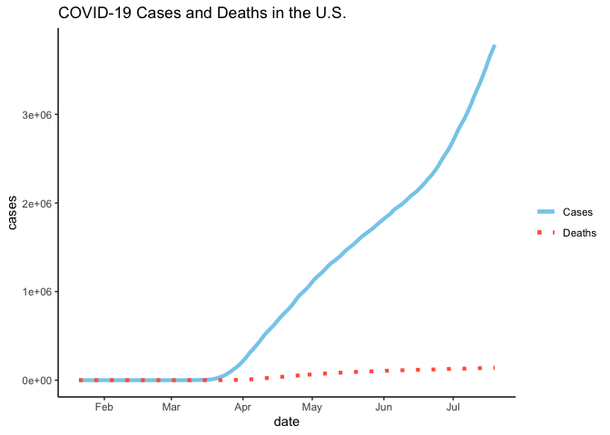
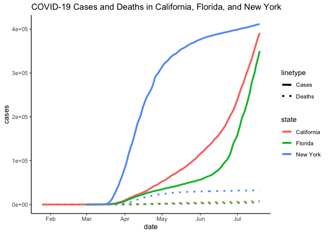

    # Load Packages
    library(ggplot2)
    library(readr)
    library(magrittr)
    library(tidyr)

    ## 
    ## Attaching package: 'tidyr'

    ## The following object is masked from 'package:magrittr':
    ## 
    ##     extract

    library(dplyr)

    ## 
    ## Attaching package: 'dplyr'

    ## The following objects are masked from 'package:stats':
    ## 
    ##     filter, lag

    ## The following objects are masked from 'package:base':
    ## 
    ##     intersect, setdiff, setequal, union

    # Read Data
    us <- read_csv("us.csv")

    ## Parsed with column specification:
    ## cols(
    ##   date = col_date(format = ""),
    ##   cases = col_double(),
    ##   deaths = col_double()
    ## )

    states <- read_csv("us-states.csv")

    ## Parsed with column specification:
    ## cols(
    ##   date = col_date(format = ""),
    ##   state = col_character(),
    ##   fips = col_character(),
    ##   cases = col_double(),
    ##   deaths = col_double()
    ## )

    head(states)

    ## # A tibble: 6 x 5
    ##   date       state      fips  cases deaths
    ##   <date>     <chr>      <chr> <dbl>  <dbl>
    ## 1 2020-01-21 Washington 53        1      0
    ## 2 2020-01-22 Washington 53        1      0
    ## 3 2020-01-23 Washington 53        1      0
    ## 4 2020-01-24 Illinois   17        1      0
    ## 5 2020-01-24 Washington 53        1      0
    ## 6 2020-01-25 California 06        1      0

Graph 1: How Caes in the Entire U.S. Grew
-----------------------------------------

    # Graph the cases
    ggplot(us, aes(x = date, y = cases, linetype = "Cases", color = "Cases")) +
      geom_line(size = 1.5) +
      # Add a layer of deaths accordingly
      geom_line(aes(x = date, y = deaths, linetype = "Deaths", color = "Deaths"), size = 1.5) +
      # solid for cases, dashed for deaths
      scale_linetype_manual(values = c("solid", "dotted")) + 
      scale_color_manual(values = c('skyblue', 'tomato')) +
      labs(color  = "", linetype = "", title = "COVID-19 Cases and Deaths in the U.S.") +
      # Bolden and center the title
      theme(plot.title = element_text(face = "bold", hjust = 0.5)) +
      # Change the theme
      theme_classic()

Graph 2: How Cases and Deaths in Those States with Most Cases Grew
------------------------------------------------------------------

    # Select the 3 states that have the most cases up until 07/17
    # Order the states by cases on 07/17
    ordered_states <- states %>% 
      filter(date == "2020-07-17") %>% 
      arrange(desc(cases))
    # Get the names of the top 5 states
    top3_name <- ordered_states$state[1:3]
    # Select all the data of the top 5 states
    top3 <- states %>% 
      filter(state %in% top3_name)

    # Graph the growth of cases in the 5 states
    ggplot(top3, aes(x = date, y = cases, color = state, linetype = "Cases")) +
      geom_line(size = 1.3) +
      # Graph the growth of deaths accordingly 
      geom_line(aes(x = date, y = deaths, color = state, linetype = "Deaths"), size = 1.3) +
      # solid for cases, dashed for deaths
      scale_linetype_manual(values = c("solid", "dotted")) +
      # Add a title
      labs(title = "COVID-19 Cases and Deaths in California, Florida, and New York")+
      # Bolden and center the title
      theme(plot.title = element_text(face = "bold", hjust = 0.5)) +
      # Change the theme
      theme_classic()

