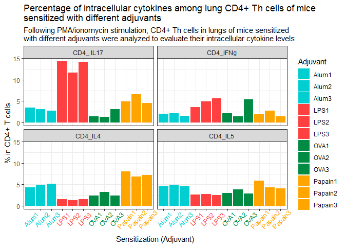

HW3
================
Angela Chun
7/19/2020

# The Data

This is a small portion of a data I made last year for my research on
generating allergic airway inflammation mice models. We examined
cellular phenotypes in the mice models of allergic asthma sensitized
with different adjuvants. The aim of our study was to determine
immunologic cellular characteristics in mouse asthma models induced by
ovalbumin (OVA) and a variety of adjuvants.

The data shows the percentages of CD+ Th cells showing 4 different
cytokines within lung, according to the adjuvants the mice were
sensitized with.

The adjuvants I used were:

1.  Ovalbumin (OVA)
2.  Lipopolysaccharide (LPS)
3.  Alhydrogel (Alum)
4.  Papain

The cytoines of interests were:

1.  IL-4
2.  IL-5
3.  IFN-γ
4.  IL-17A

Three mice (indicated by the numbers 1, 2, and 3) were used per adjuvant
to generate a total of 12 mice models.

# Exporting the excel file

I used read\_excel() from the “readxl” package.

``` r
Tsti_Data <- read_excel("Tsti Data.xlsx", sheet = 1)
Tsti_Data
```

    ## # A tibble: 12 x 5
    ##    Adjuvant CD4_IL4 CD4_IL5 CD4_IFNg `CD4_ IL17`
    ##    <chr>      <dbl>   <dbl>    <dbl>       <dbl>
    ##  1 OVA1        2.43    2.96     2.11        1.5 
    ##  2 OVA2        3.23    3.84     1.49        1.33
    ##  3 OVA3        2.38    2.9      5.39        3.11
    ##  4 LPS1        1.52    2.65     3.64       14.3 
    ##  5 LPS2        1.3     2.71     4.98       11.6 
    ##  6 LPS3        1.56    2.49     5.67       14.2 
    ##  7 Alum1       4.27    4.65     2.04        3.47
    ##  8 Alum2       4.89    4.87     2.21        3.14
    ##  9 Alum3       5.2     4.58     1.57        2.77
    ## 10 Papain1     8.08    5.83     1.98        4.9 
    ## 11 Papain2     6.81    4.35     2.73        6.66
    ## 12 Papain3     7.19    4.04     1.43        4.61

# The Graph

I wanted to display four separate graphs according to the cytokines the
T cells were expressing

  - Used facet\_wrap() to achieve this.

I also wanted to group the mice models according to the adjuvants groups
- Decided to do this by color/fill.

``` r
Tsti_Data %>%
  gather(Tsti_Data, value, -Adjuvant) %>%
  ggplot(aes(Adjuvant, value, fill = Adjuvant)) + 
  geom_bar(stat = "identity") + 
  
  #Manually changed the colors so each adjuvant group would display the same color
  
  scale_fill_manual(values = c("darkturquoise", "darkturquoise", "darkturquoise", "brown1", "brown1", "brown1", "springgreen4", "springgreen4", "springgreen4", "orange", "orange", "orange")) + 
  facet_wrap(~Tsti_Data) +
  
  #Changed the title and axis labels
  
  labs(title = "Percentage of intracellular cytokines among lung CD4+ Th cells of mice \nsensitized with different adjuvants", x = "Sensitization (Adjuvant)", y = "% in CD4+ T cells", subtitle = "Following PMA/ionomycin stimulation, CD4+ Th cells in lungs of mice sensitized \nwith different adjuvants were analyzed to evaluate their intracellular cytokine levels") + 
  theme_bw() + 
  
  #The x axis text were overlapping, so fixed it by adjusting the angle and height and also applied the color scheme.
  
  theme(axis.text.x = element_text(angle = 45, vjust = 0.7, color = c("darkturquoise", "darkturquoise", "darkturquoise", "brown1", "brown1", "brown1", "springgreen4", "springgreen4", "springgreen4", "orange", "orange", "orange"))) 
```

    ## Warning: Vectorized input to `element_text()` is not officially supported.
    ## Results may be unexpected or may change in future versions of ggplot2.

<!-- -->
