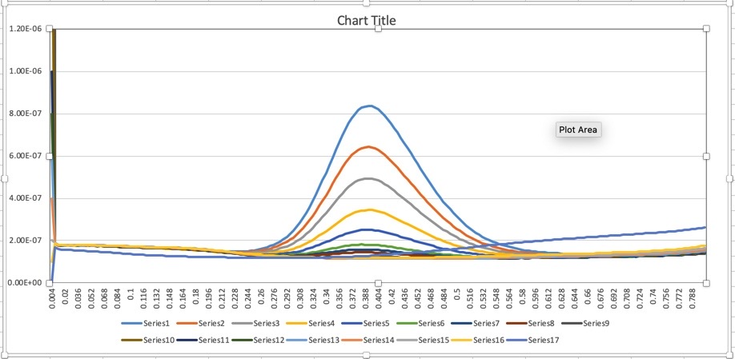

Sandra Markdown
================
Althea Bock-Hughes
7/19/2020

\#\#Overveiw of data

``` r
library(readr)
library(ggplot2)

Echem <- read.csv("concentrations v peak.csv")
str(Echem)
```

    ## 'data.frame':    200 obs. of  18 variables:
    ##  $ Potential.V: num  0.004 0.008 0.012 0.016 0.02 0.024 0.028 0.032 0.036 0.04 ...
    ##  $ X1.00E.04  : num  1.86e-07 1.77e-07 1.76e-07 1.75e-07 1.75e-07 1.75e-07 1.75e-07 1.76e-07 1.75e-07 1.76e-07 ...
    ##  $ X8.00E.05  : num  1.86e-07 1.77e-07 1.76e-07 1.75e-07 1.75e-07 1.75e-07 1.75e-07 1.75e-07 1.76e-07 1.76e-07 ...
    ##  $ X6.00E.05  : num  1.86e-07 1.78e-07 1.76e-07 1.76e-07 1.75e-07 1.75e-07 1.76e-07 1.76e-07 1.76e-07 1.76e-07 ...
    ##  $ X4.00E.05  : num  1.86e-07 1.78e-07 1.76e-07 1.76e-07 1.76e-07 1.76e-07 1.76e-07 1.76e-07 1.76e-07 1.76e-07 ...
    ##  $ X2.00E.05  : num  1.87e-07 1.78e-07 1.77e-07 1.76e-07 1.76e-07 1.76e-07 1.76e-07 1.76e-07 1.76e-07 1.77e-07 ...
    ##  $ X1.00E.05  : num  1.87e-07 1.78e-07 1.76e-07 1.76e-07 1.76e-07 1.76e-07 1.76e-07 1.76e-07 1.76e-07 1.76e-07 ...
    ##  $ X8.00E.06  : num  1.87e-07 1.78e-07 1.77e-07 1.76e-07 1.76e-07 1.76e-07 1.76e-07 1.76e-07 1.76e-07 1.76e-07 ...
    ##  $ X6.00E.06  : num  1.87e-07 1.78e-07 1.77e-07 1.77e-07 1.76e-07 1.76e-07 1.76e-07 1.76e-07 1.76e-07 1.76e-07 ...
    ##  $ X4.00E.06  : num  1.87e-07 1.79e-07 1.77e-07 1.77e-07 1.75e-07 1.76e-07 1.75e-07 1.75e-07 1.75e-07 1.75e-07 ...
    ##  $ X2.00E.06  : num  1.87e-07 1.78e-07 1.77e-07 1.76e-07 1.76e-07 1.76e-07 1.76e-07 1.77e-07 1.77e-07 1.76e-07 ...
    ##  $ X1.00E.06  : num  1.87e-07 1.79e-07 1.77e-07 1.77e-07 1.76e-07 1.77e-07 1.77e-07 1.77e-07 1.77e-07 1.77e-07 ...
    ##  $ X8.00E.07  : num  1.88e-07 1.79e-07 1.77e-07 1.77e-07 1.77e-07 1.77e-07 1.77e-07 1.77e-07 1.77e-07 1.77e-07 ...
    ##  $ X6.00E.07  : num  1.88e-07 1.79e-07 1.78e-07 1.77e-07 1.77e-07 1.77e-07 1.77e-07 1.78e-07 1.77e-07 1.77e-07 ...
    ##  $ X4.00E.07  : num  1.88e-07 1.80e-07 1.78e-07 1.78e-07 1.77e-07 1.78e-07 1.77e-07 1.78e-07 1.77e-07 1.78e-07 ...
    ##  $ X2.00E.07  : num  1.89e-07 1.80e-07 1.79e-07 1.78e-07 1.78e-07 1.78e-07 1.78e-07 1.79e-07 1.78e-07 1.79e-07 ...
    ##  $ X1.00E.07  : num  1.88e-07 1.79e-07 1.78e-07 1.78e-07 1.77e-07 1.77e-07 1.77e-07 1.78e-07 1.77e-07 1.78e-07 ...
    ##  $ X0.00E.00  : num  1.67e-07 1.60e-07 1.57e-07 1.57e-07 1.56e-07 1.55e-07 1.54e-07 1.53e-07 1.53e-07 1.52e-07 ...

\#\#\#Original plot



\#\#New plot made with
ggplot

    ## Warning in data(Echem): data set 'Echem' not found

<!-- -->

Note that the `echo = FALSE` parameter was added to the code chunk to
prevent printing of the R code that generated the plot.
