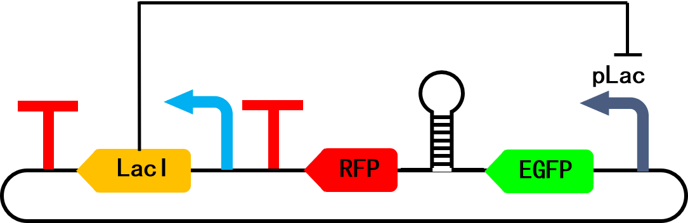
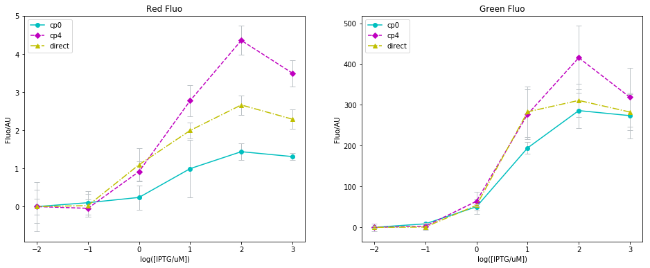
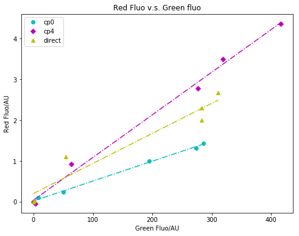

# HW03: Remaking Some Microtiter Plate Graphs

## Brief explaination

These graphs are from an old project focusing on the genetic manipulation of *Escherichia coli*. In this project, we designed a short sequence to be inserted in between two coding sequences (CDS) to couple the translation of these two. After transcripting into mRNA, the short sequence form a stem loop which traps the Ribosome Binding Site (RBS) inside, thus the expression of the downstream CDS is much attenuated.

The CDSes flanking the stem loop are fluorescence proteins of different emission wavelengths (i.e. different colors) so that they can be readily quantified by the microtiter plate assay. Here is a schematic map of the plasmid carrying the sequences described above:

## Old images

I have summarized the microtiter plate data with Python before, with the old images shown below. This time, I remake these graphs using R in this [R Markdown](remake.md).

I also kept an excerpt of the original HW03 notes below:

## Assignment

Read in some data and graph something in R

## Notes for the assignment 

Note #1: We haven't yet hit the data wrangling/manipulation section, so do be mindful that the data you import should be formatted reasonably so you can graph it.

Note #2: you can choose to code using an R script or R markdown.

Note #3, remember that there is a file size limit of 100 MB.

Note #4, remember to edit this Readme file and explain what you are doing!

Note #5, if you are trying to update or remake a graph you have previously made, it would be a good idea to include the original image in the repository.

Note #6, remember that these Github pages are public repositories, anyone could find them so don't use sensitive data or data your lab doesn't want to be somewhere on the internet.
