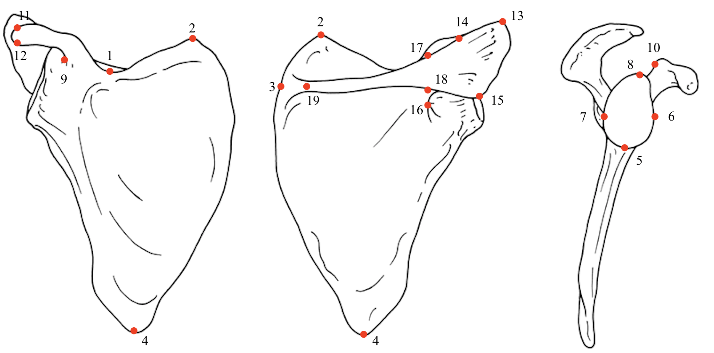
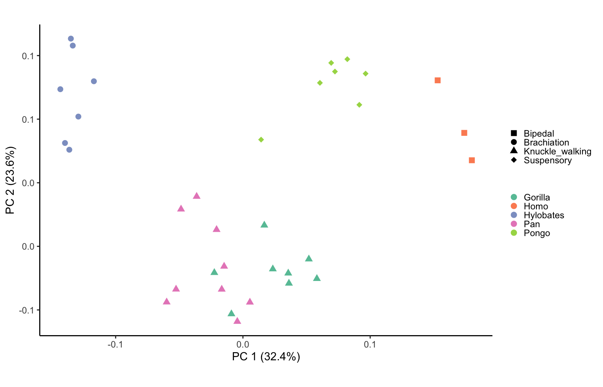

# HW03 - Hannah Farrell
## Assignment:
Read in some data and graph something in R

In my field, we need to be able to quantitatively compare bone morphology between species. I collected landmark data from the right scapulae (shoulder bones) of five different ape species with very different locomotor modes. 

The purpose of my comparison is to see if scapular morphology can separate species by their distinctive locomotor behaviors. You should hopefully be able to see in my graph that shoulder morphology seems to separate species by this behavior very well, and it will take further investigation to determine which parts of the bone hold this functionally significant information.

Side Note: I really wanted to make a cooler graph, but it turns out my code to calculate the PCA information was out of date so I spent a solid 3 hours trying to figure that out just so I could get a graph to pop up! So please enjoy this graph, expect to see nicer versions of it in the future, and I look forward to any and all feedback to improve my coding!

