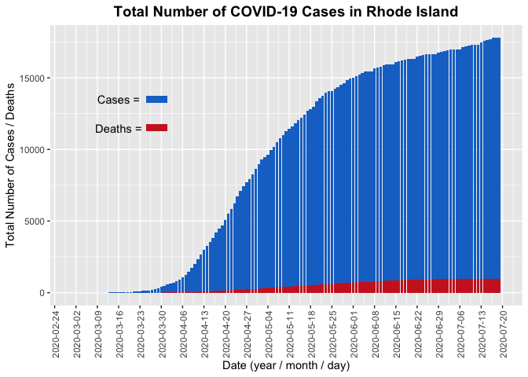
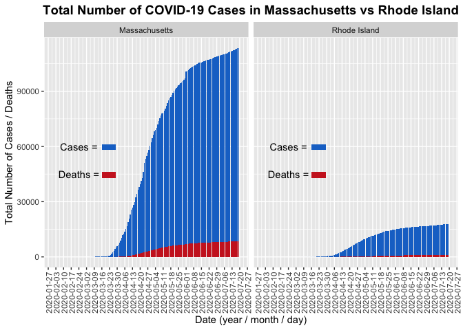
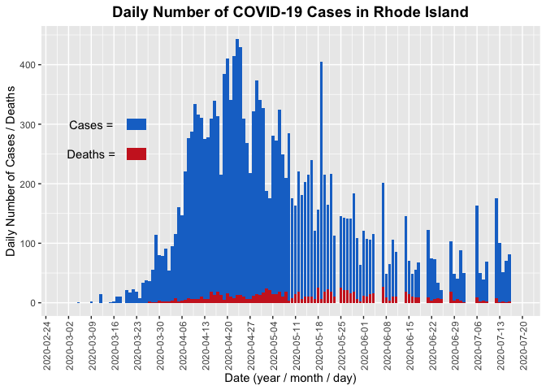

HW03
================
Ariana F. Tortolani
7/20/2020

## Description

For this assignment I will be using the COVID-19 data from the NYT’s
Github Repository to generate these figures.

Below I am loading important libraries that will be useful in creating
my figures.

``` r
library("ggplot2")
library("magrittr")
library("readr")
library("dplyr")
```

    ## 
    ## Attaching package: 'dplyr'

    ## The following objects are masked from 'package:stats':
    ## 
    ##     filter, lag

    ## The following objects are masked from 'package:base':
    ## 
    ##     intersect, setdiff, setequal, union

## Import the Data

I am using the us-states.cvs dataset from the NYT. First I went to the
[NYT Github Repository for COVID-19
Data](https://github.com/nytimes/covid-19-data). I forked this
repository and then downloaded the specific file I was interested in,
*“us-states.csv”*. After downloading this to my computer I then
uploaded it back to my HW03 Github repository by clicking the “add file”
button in github, then I pulled the change back down to RStudio to work
with this file.

QUESTION: I was trying to find a way to add this document directly from
one github repository to another (i.e. going directly from the NYT repo
to my HW03 repo without having to download the file to my computer and
reupload). I was not able to find a good way to do this and was
wondering if anyone else had?

``` r
all_states <- read.csv("us-states.csv", stringsAsFactors = FALSE)
```

\#\#Graph 1

Evaluating the prevalence of COVID-19 in Rhode Island.

``` r
#filter the data for only Rhode Island
all_states %>%
  filter(state == "Rhode Island") -> RI_data
  
#re-format the date col
RI_data$date <- as.Date(RI_data$date)

#create the plot 
RI_plot <- ggplot(RI_data) +
  geom_col(aes(date, cases), fill = "dodgerblue3") +
  geom_col(aes(date, deaths), fill = "firebrick3") +
  
#add axis labels / title
  labs (title = "Total Number of COVID-19 Cases in Rhode Island",
            x = "Date (year / month / day)", 
            y = "Total Number of Cases / Deaths") +

#make easier to read
  theme(axis.text.x = element_text(angle=90, vjust = 0.65),
        plot.title = element_text(size = 14, face = "bold", hjust = 0.5),
        legend.position = c(1,1)) +
  scale_x_date(date_breaks = "1 weeks") +
  
#create legend
  annotate("text", as.Date("2020-03-16"), 13500, label = "Cases =") +
  annotate("rect", xmin = as.Date("2020-03-25"), xmax = as.Date("2020-04-01"),
                   ymin = 13250, ymax = 13750,
                   fill = "dodgerblue3") +
  annotate("text", as.Date("2020-03-16"), 11500, label = "Deaths =") +
  annotate("rect", xmin = as.Date("2020-03-25"), xmax = as.Date("2020-04-01"),
                   ymin = 11250, ymax = 11750,
                   fill = "firebrick3")

#show plot
RI_plot
```

<!-- -->

\#\#Graph 2

Compare Rhode Island to Massachusetts.

``` r
#filter the data for only Rhode Island
all_states %>%
  filter(state == "Massachusetts" | state == "Rhode Island") -> MA_RI_data
  
#re-format the date col
MA_RI_data$date <- as.Date(MA_RI_data$date)

#create the plot 
MA_RI_plot <- ggplot(MA_RI_data) +
  geom_col(aes(date, cases), fill = "dodgerblue3") +
  geom_col(aes(date, deaths), fill = "firebrick3") +
  facet_wrap(~state) +
  
#add axis labels / title
  labs (title = "Total Number of COVID-19 Cases in Massachusetts vs Rhode Island",
            x = "Date (year / month / day)", 
            y = "Total Number of Cases / Deaths") +

#make easier to read
  theme(axis.text.x = element_text(angle=90, vjust = 0.65),
        plot.title = element_text(size = 14, face = "bold", hjust = 0.5)) +
  scale_x_date(date_breaks = "1 weeks") +
  
#create legend
  annotate("text", as.Date("2020-02-24"), 60000, label = "Cases =") +
  annotate("rect", xmin = as.Date("2020-03-16"), xmax = as.Date("2020-03-29"),
                   ymin = 61000, ymax = 58000,
                   fill = "dodgerblue3") +
  annotate("text", as.Date("2020-02-24"), 45000, label = "Deaths =") +
  annotate("rect", xmin = as.Date("2020-03-16"), xmax = as.Date("2020-03-29"),
                   ymin = 46000, ymax = 43000,
                   fill = "firebrick3")

#show plot
MA_RI_plot
```

<!-- -->

\#\#Graph 3

Look at number of new daily cases in Rhode Island.

``` r
#define new variables
RI_data$new_cases <- lead(RI_data$cases, 1) - RI_data$cases
RI_data$new_deaths <- lead(RI_data$deaths, 1) - RI_data$deaths

#create the plot 
RI_new_daily_plot <- ggplot(RI_data) +
  geom_col(aes(date, new_cases), fill = "dodgerblue3") +
  geom_col(aes(date, new_deaths), fill = "firebrick3") +
  
#add axis labels / title
  labs (title = "Daily Number of COVID-19 Cases in Rhode Island",
            x = "Date (year / month / day)", 
            y = "Daily Number of Cases / Deaths") +

#make easier to read
  theme(axis.text.x = element_text(angle=90, vjust = 0.65),
        plot.title = element_text(size = 14, face = "bold", hjust = 0.5),
        legend.position = c(1,1)) +
  scale_x_date(date_breaks = "1 weeks") +
  
#create legend
  annotate("text", as.Date("2020-03-09"), 300, label = "Cases =") +
  annotate("rect", xmin = as.Date("2020-03-20"), xmax = as.Date("2020-03-26"),
                   ymin = 310, ymax = 290,
                   fill = "dodgerblue3") +
  annotate("text", as.Date("2020-03-09"), 250, label = "Deaths =") +
  annotate("rect", xmin = as.Date("2020-03-20"), xmax = as.Date("2020-03-26"),
                   ymin = 260, ymax = 240,
                   fill = "firebrick3")

#show plot
RI_new_daily_plot
```

    ## Warning: Removed 1 rows containing missing values (position_stack).
    
    ## Warning: Removed 1 rows containing missing values (position_stack).

<!-- -->
