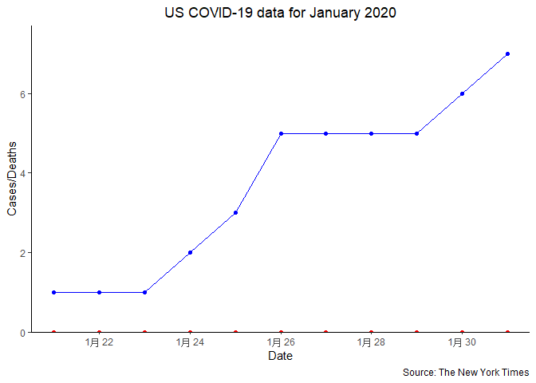
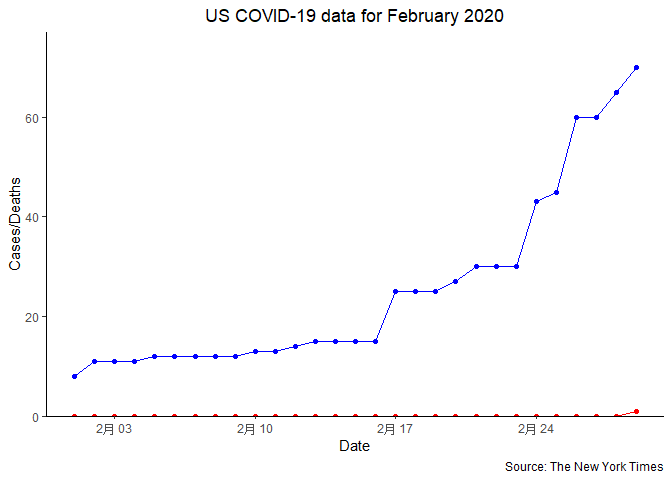
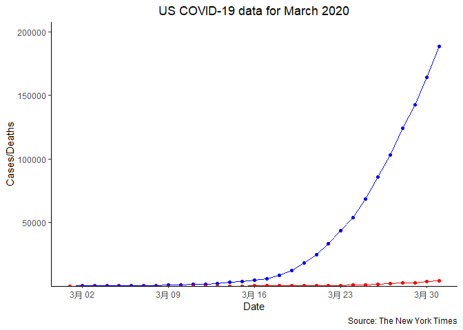

US COVID-19
================
Xing Yanfeng
2020/7/20

This is graphs of **US COVID-19 for January to March 2020** data to show
tendency of case and death increase. The **blue** points and lines show
total **cases**, while the **red** ones show total **deaths**.

### US COVID-19 data for January 2020

<!-- -->

### US COVID-19 data for February 2020

<!-- -->

### US COVID-19 data for March 2020

<!-- -->
