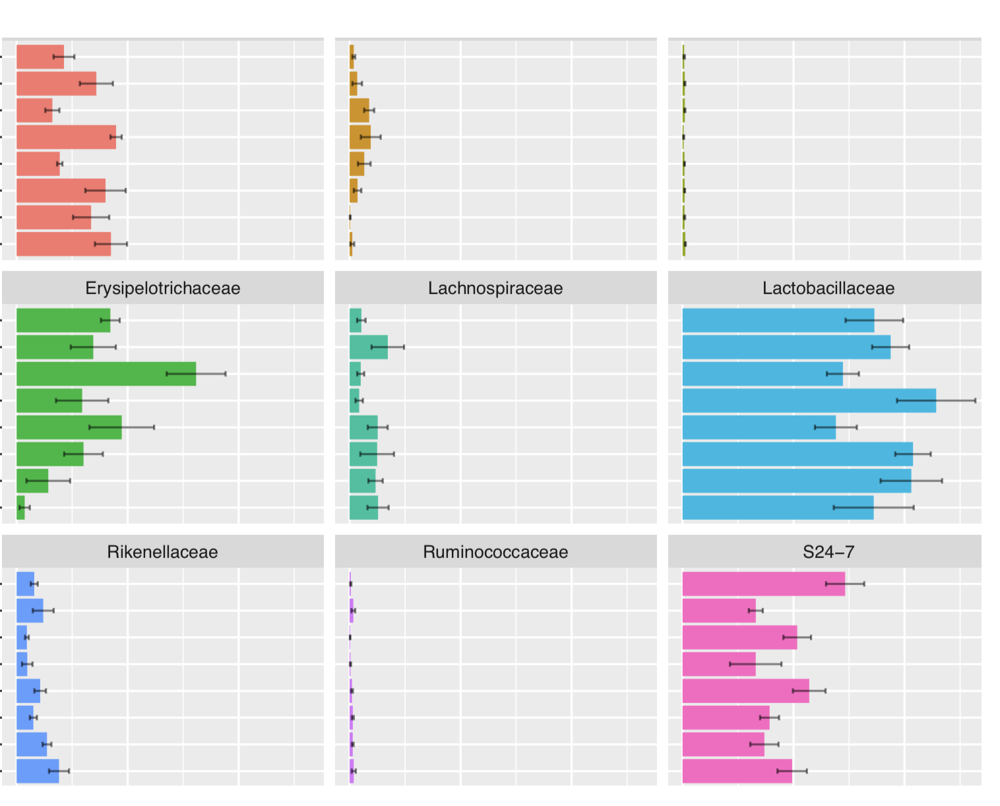
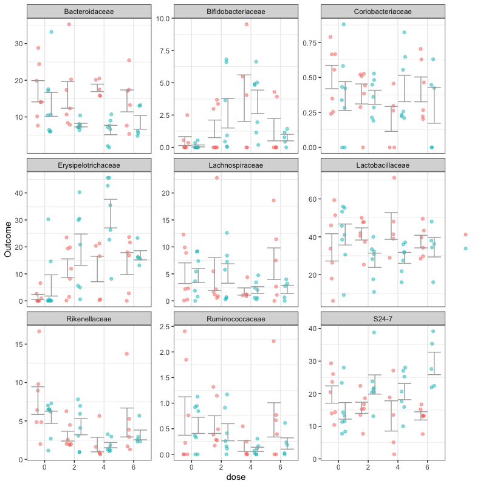

```{r setup, include=FALSE}
knitr::opts_chunk$set(echo = TRUE)
```

## GitHub Documents

We learnt from datacamp that barplot with errorbar doesn't show the distribution of individual data points, instead dot plot is more appropriate.

My old plot is here: 
<!-- -->

```{r }
library(ggplot2)
library(stats)
```

## newplot

```{r pressure, echo=T}
ggplot(pd_agg_family, aes(Source, Abundance, color=Treatment,group=Treatment))+
    geom_point(position=position_jitterdodge(),alpha=0.5)+
    stat_summary(geom="errorbar", fun.data=mean_se, fun.args=list(mult=1), color = "darkgrey", position="dodge")+
    facet_wrap(~Family, ncol=3,scales="free_y")+
    theme_bw()+
    labs(x="dose",y="Outcome",legend="")+
    theme(legend.title =element_blank(),legend.text=element_blank(),panel.grid.major.y = element_blank())
```
<!-- -->
