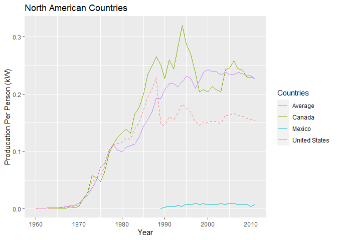
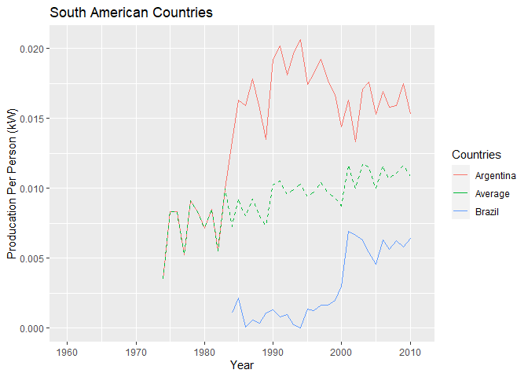
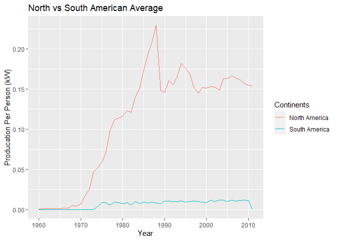

    ##North American Countries
    nuc_data <- read_excel("nuclear_power_generation_per_person2.xlsx", "North")

    ggplot(data=nuc_data, sheet='North')+
      geom_line(aes(Year,Canada,color='Canada'))+
      geom_line(aes(Year,Mexico,color='Mexico'))+
      geom_line(aes(Year,United,color='United States'))+
      geom_line(aes(Year,Average,color='Average'), linetype='dashed')+
      labs(y="Producation Per Person (kW)", title="North American Countries",legend.title="Country",color="Countries")

    ## Warning: Removed 3 row(s) containing missing values (geom_path).

    ## Warning: Removed 29 row(s) containing missing values (geom_path).

\#\#South American Countries

    ##South American Countries
    nuc_data <- read_excel("nuclear_power_generation_per_person2.xlsx", "South")

    ggplot(data=nuc_data)+
      geom_line(aes(Year,Argentina, color='Argentina'))+
      geom_line(aes(Year,Brazil, color='Brazil'))+
      geom_line(aes(Year,Average, color='Average'), linetype='dashed')+
      labs(y="Producation Per Person (kW)", title="South American Countries",color="Countries")

    ## Warning: Removed 15 row(s) containing missing values (geom_path).

    ## Warning: Removed 25 row(s) containing missing values (geom_path).

    ## Warning: Removed 15 row(s) containing missing values (geom_path).

    ##Comparison
    nuc_data <- read_excel("nuclear_power_generation_per_person2.xlsx", "Combo")

    ggplot(data=nuc_data)+
      geom_line(aes(Year,Naverage, color='North America'))+
      geom_line(aes(Year,Saverage, color='South America'))+
      labs(y="Producation Per Person (kW)", title="North vs South American Average",color="Continents")

All data garnered from [Gapminder](https://www.gapminder.org/data/)
